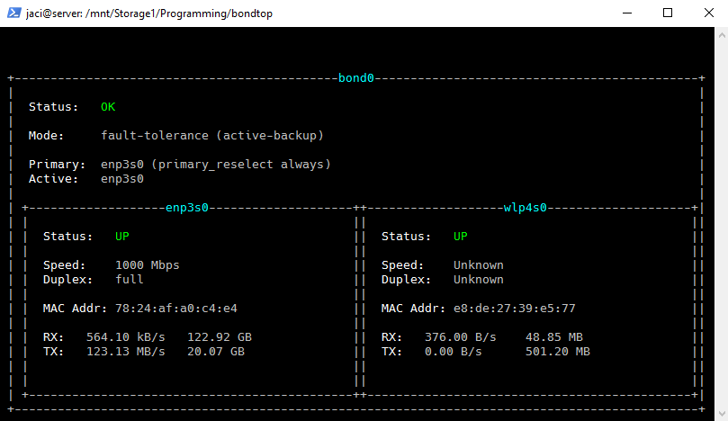
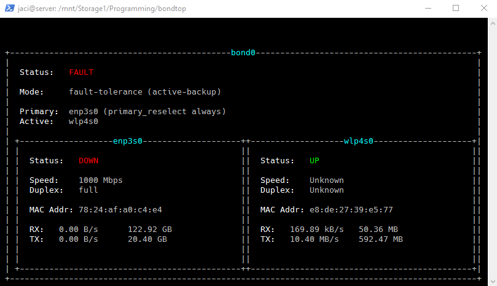

# bondtop
Simple Curses UI for ifenslave Network Bonding

BondTop currently works with active-backup network bonds, showing 
information about which interfaces are up, their speed and other 
details, as well as current usage and total data transferred.

## In Action





## Build 
```bash
$ make
```

To install onto your system: 
```bash
$ make install
```

Run with 
```bash
bondtop
```